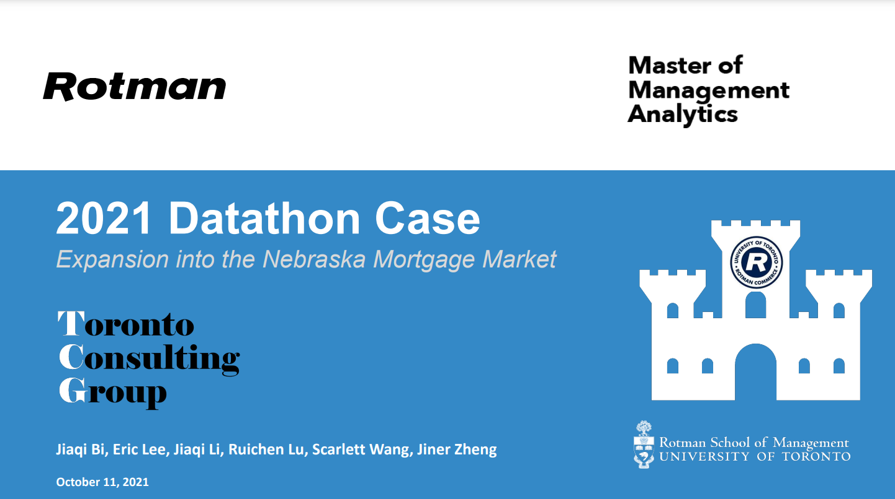

## Description:
This is a data analysis project on Exansion into Nebraska Mortgage Market for [2021 MMA Datathon](https://www.rotman.utoronto.ca/Degrees/MastersPrograms/MMA/datathon2021faq) 

## Case Challenge: 
Analyzing the Nebraska Mortgage Loan Market
- `Team name`: Team TCG (Toronto Consulting Group)
- `Team members`: [Jiaqi Bi](), [Eric Lee](), [Jiaqi Li](), [Ruichen Lu](), [Scarlett Wang](), [Jiner Zheng]()

## Background
- A mortgage loan is a loan used to purchase real estate and is secured by the underlying property. The secondary mortgage market is where existing mortgage loans are bought and sold between lenders and investors. In the United States, one of the largest purchasers of mortgage loans is the government-sponsored enterprise Federal National Mortgage Association, commonly known as Fannie Mae. They purchase loans from primary lenders, bundle them together, and package them into a mortgage-backed security, which can be sold to investors in the secondary mortgage market.

## Problem
- To analyze data of all convensional single-family, fixed interest rate mortgages from 2000-2021Q1 via Fannie Mae and determine a recommendation on which segments of the Nebraska mortgage market to focus on.
- The primary consideration is to maximize the dollar value of mortgages issued while limiting the number of defaulting loans with additional considerations for future changes in the interest rates, state of the economy, and the ability to execute on the strategy.
- To carry out an actionable plan for Great Lake Midwest Bank,  a regional bank operating in the states of Illinois, Iowa, and Wisconsin, to do the mortgage expansion on state of Nebraska.

**Presentation Slides:** This is our presentation slides outlining our analytical roadmap, findings, recommendations, along with appendix: [Presentation Slides](https://github.com/Cyanjiner/Mortgage-Market-Expansion/blob/main/Datathon%20-%20TCG%20Presentation.pptx.pdf)

**Useful Code:** We use R and Python as our analytical tool to conduct statistical test and data visualizations for this challenge: [Datathon.Rmd](https://github.com/Cyanjiner/Mortgage-Market-Expansion/blob/main/Datathon.Rmd), [corr_matrix.py](https://github.com/Cyanjiner/Mortgage-Market-Expansion/blob/main/corr_matrix.py)
